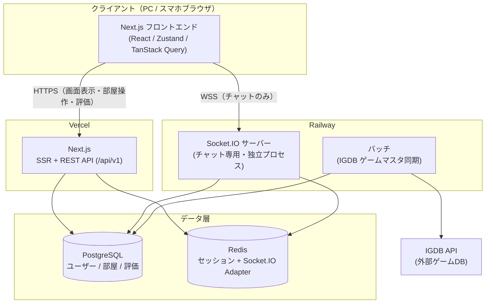
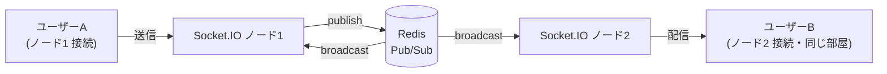
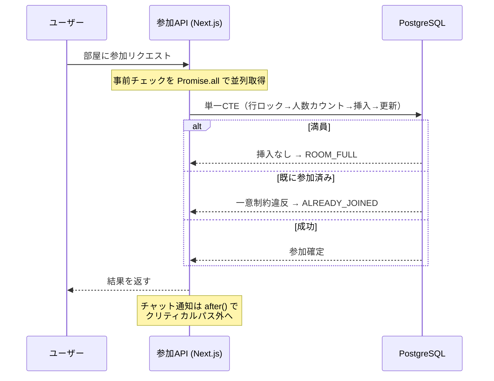
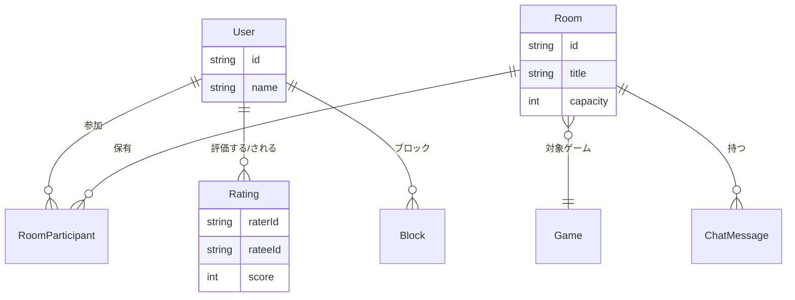

# アーキテクチャ解説（図でわかる QuestLink）

> このドキュメントは **コードを読まずに技術構成と設計意図を把握する** ための資料です。
> 採用担当者・レビュアー向けに、「何を・なぜ・どう作ったか」を図中心でまとめています。
> 詳細な技術選定理由は [`01_architecture.md`](01_architecture.md)、性能改善は [README](../README.md#負荷テストとパフォーマンス改善) を参照してください。

---

## 1. これは何のサービスか

**「今すぐ一緒にゲームできる仲間」をその場でマッチングするプラットフォーム。**

```
部屋を探す / 作る  →  参加する  →  チャットで合流  →  一緒に遊ぶ  →  相手を評価する
   (REST)            (REST)        (WebSocket)                      (REST)
```

- ユーザー: 日本のカジュアルゲーマー（10〜30 代）、PC・スマホ両対応
- 最重要の体験: 「知らない人と組む」不安を下げる（評価・ブロック・通報・ゲスト参加）

---

## 2. システム全体構成

リアルタイム通信（WebSocket）と通常の API（HTTP）を **別のサーバーに分離** しているのが最大の特徴です。



**なぜ分離したか**

| | HTTP (Next.js) | WebSocket (Socket.IO) |
|---|---|---|
| 通信の性質 | 短命・リクエスト/レスポンス | 長命・常時接続 |
| 負荷のかかり方 | リクエスト数に比例 | 同時接続数に比例 |
| スケールの軸 | CPU / DB | コネクション数 / メモリ |

→ 性質が異なる 2 つを同一プロセスにすると、片方の負荷がもう片方を巻き込む。**別プロセスにして独立してスケール** できるようにした。

---

## 3. リアルタイムチャットの水平スケール

Socket.IO サーバーを増やしても、**全ノードのクライアントにメッセージが届く** 設計です。



- **Socket.IO Redis Adapter** が部屋のブロードキャストを Redis Pub/Sub 経由で全ノードに伝搬。
- 1 ノードの接続上限に達しても、**ノードを足すだけ** で収容数を増やせる。
- 負荷テスト（Phase 4 / 5 / 6）で、複数部屋・最大人数部屋の fan-out が欠落しないことを検証済み。

---

## 4. 「壊れない参加処理」の作り方

満員部屋への同時参加や二重参加は toC で必ず起きる競合。**DB の制約とアトミックなクエリ** で守っています。



**ポイント**

- ロック・カウント・挿入・更新を **1 つの CTE** にまとめ、アプリ ↔ DB の往復を **9 回 → 2 回** に削減。
- 「アクティブ参加者の一意部分インデックス」で **二重参加を DB レベルで物理的に不可能** にした（アプリのバグに依存しない）。
- チャット通知などクリティカルでない処理は `after()` でレスポンス後に回し、体感速度を優先。

---

## 5. データモデルの中心



- **評価（Rating）** は「同じ相手を同じ部屋で二重評価しない」を UNIQUE 制約で担保。
- **ブロック（Block）** は部屋一覧クエリにサブクエリとして統合し、ブロック相手の部屋を一覧から除外。
- 部屋名・募集文の検索は PostgreSQL の `tsvector` + `GIN` インデックスで全文検索。

---

## 6. 品質と運用

| 観点 | 取り組み |
|------|----------|
| 型安全 | TypeScript strict、`any` 禁止、Zod で API 入力を検証 |
| テスト | Vitest（単体）、Playwright（E2E）、対象と同階層に `.test.ts` |
| 静的解析 | ESLint / Prettier で CI 強制 |
| 性能検証 | k6 による負荷テスト一式（[`load-test/`](../load-test/)）と結果の数値化 |
| 監視 | `web-vitals` 計測、`/api/v1/metrics`・`/api/v1/health` エンドポイント |

---

## 7. 1 枚まとめ（面接で話すなら）

> QuestLink は、**リアルタイム性・アクセス集中・スケール** という toC 特有の課題に向き合った個人開発です。
> HTTP と WebSocket を別プロセスに分離し、Socket.IO + Redis Adapter で水平スケール可能なチャット基盤を構築。
> k6 で本番相当の負荷をかけてボトルネックを特定し、**部屋一覧 API の p95 を約 2 倍高速化（1,286ms → 605ms）**、参加処理は CTE で **DB 往復を 9→2 回** に削減しました。
> 整合性はアプリ任せにせず **DB 制約・部分インデックス** で守り、競合下でも壊れない設計にしています。
